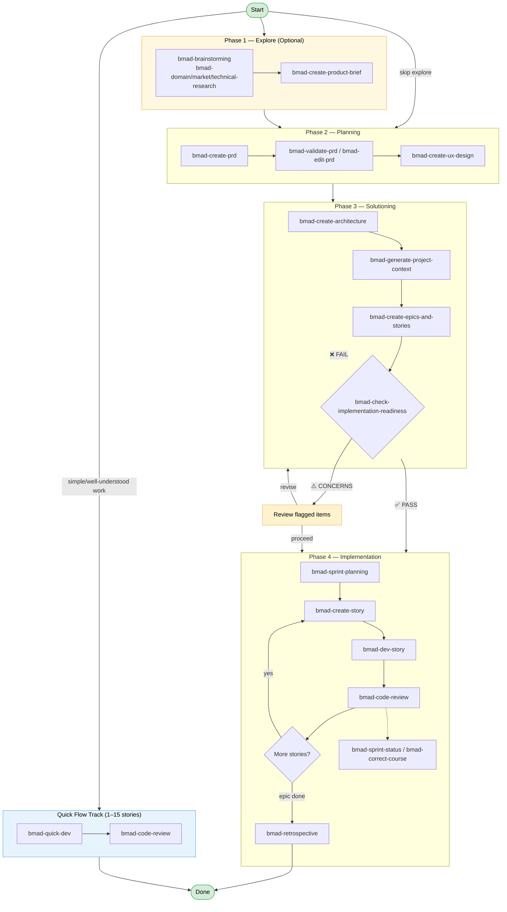

# BMAD Workflows Reference

#bmad #workflows #reference #sdd #commands

> **Sources:** [Workflows Reference | BMAD Method](https://docs.bmad-method.org/reference/workflows/) · [Workflow Map | BMAD Method](https://docs.bmad-method.org/reference/workflow-map/)

## Overview

The BMM module provides **34+ workflows** organized across 4 phases. Every workflow can be run directly via slash command or by loading an agent first and selecting the trigger from the agent menu.

---

## Workflow Diagram



> 🟡 **Phase 1** and the **Quick Flow Track** are optional paths. Documentation workflows (`bmad-document-project`, etc.) and test automation (`bmad-automate`) are available at any phase and are not shown above. `bmad-help` can be invoked at any time from any agent to inspect project state and get a recommended next step.

---

## Phase 1 — Explore / Analysis *(Optional)*

> Validate the problem space before committing to planning.

| Skill / Command | Agent | Output |
|---|---|---|
| `bmad-brainstorming` | `bmad-analyst` | `brainstorming-report.md` |
| `bmad-domain-research` | `bmad-analyst` | Domain research findings |
| `bmad-market-research` | `bmad-analyst` | Market research findings |
| `bmad-technical-research` | `bmad-analyst` | Technical research findings |
| `bmad-create-product-brief` | `bmad-analyst` | `product-brief.md` |

---

## Phase 2 — Planning *(Required)*

> Define *what* to build and *for whom*.

| Skill / Command | Agent | Output |
|---|---|---|
| `bmad-create-prd` | `bmad-pm` | `PRD.md` |
| `bmad-validate-prd` | `bmad-pm` | Validation report |
| `bmad-edit-prd` | `bmad-pm` | Updated `PRD.md` |
| `bmad-create-ux-design` | `bmad-ux-designer` | `ux-spec.md` |

---

## Phase 3 — Solutioning *(BMad Method / Enterprise only)*

> Decide *how* to build it and break work into executable stories.

| Skill / Command | Agent | Output |
|---|---|---|
| `bmad-create-architecture` | `bmad-architect` | `architecture.md` + ADRs |
| `bmad-generate-project-context` | `bmad-analyst` | `project-context.md` |
| `bmad-create-epics-and-stories` | `bmad-pm` | Epic + story files |
| `bmad-check-implementation-readiness` | `bmad-architect` / `bmad-pm` | PASS / CONCERNS / FAIL |

> **Implementation Readiness Gate** returns one of three statuses:
> - ✅ **PASS** — proceed to Phase 4
> - ⚠️ **CONCERNS** — review flagged items, then decide
> - ❌ **FAIL** — return to solutioning before building

---

## Phase 4 — Implementation

> Build incrementally, one story at a time.

### Sprint Initialization

| Skill / Command | Agent | Output |
|---|---|---|
| `bmad-sprint-planning` | `bmad-sm` | `sprint-status.yaml` |

### Per-Story Build Cycle *(repeat)*

| Skill / Command | Agent | Output |
|---|---|---|
| `bmad-create-story` | `bmad-sm` | `story-[slug].md` |
| `bmad-dev-story` | `bmad-dev` | Working code + tests |
| `bmad-code-review` | `bmad-dev` | Review approval / feedback |

### Mid-Sprint & Tracking

| Skill / Command | Agent | Output |
|---|---|---|
| `bmad-sprint-status` | `bmad-sm` | Progress status update |
| `bmad-correct-course` | `bmad-sm` / `bmad-pm` | Updated plan |

### Epic Completion

| Skill / Command | Agent | Output |
|---|---|---|
| `bmad-retrospective` | `bmad-sm` | Retrospective notes |

---

## Quick Flow Track *(Parallel — bypasses Phases 2–3)*

> For simple, well-understood work (1–15 stories). Skips architecture entirely.

| Skill / Command | Agent | Output |
|---|---|---|
| `bmad-quick-dev` | `bmad-master` | `tech-spec.md` + code |
| `bmad-code-review` | `bmad-master` | Review approval / feedback |

---

## Documentation Workflows *(Any Phase)*

| Skill / Command | Agent | Output |
|---|---|---|
| `bmad-document-project` | `bmad-tech-writer` | Project documentation |
| `bmad-write-document` | `bmad-tech-writer` | Custom document |
| `bmad-update-standards` | `bmad-tech-writer` | Updated standards |
| `bmad-mermaid-generate` | `bmad-tech-writer` | Mermaid diagram |
| `bmad-validate-doc` | `bmad-tech-writer` | Doc validation report |
| `bmad-explain-concept` | `bmad-tech-writer` | Concept explanation |

---

## Test Automation *(Any Phase)*

| Skill / Command | Agent | Output |
|---|---|---|
| `bmad-automate` | `bmad-qa` | Test suite files |

---

## bmad-help — Context-Aware Guide

```
bmad-help              # Inspect project state, recommend next step
bmad-help [question]   # Answer a specific question about the workflow
```

Runs automatically at the end of every workflow. Can be invoked at any time from any agent.

---

## Context Management

`project-context.md` acts as a **constitution for your project** — it guides implementation decisions across all workflows and ensures agent consistency. Generate it with `bmad-generate-project-context` after architecture, or write it manually at `_bmad-output/project-context.md`.

---

## Execution Rules

- Each workflow runs in a **fresh chat session**
- Workflows build on prior artifacts — order matters
- Every workflow can be run as a slash command OR via agent trigger menu

---

## Related Notes

- [[BMAD-Getting-Started]]
- [[BMAD-Agents]]
- [[SDD-Index]]
