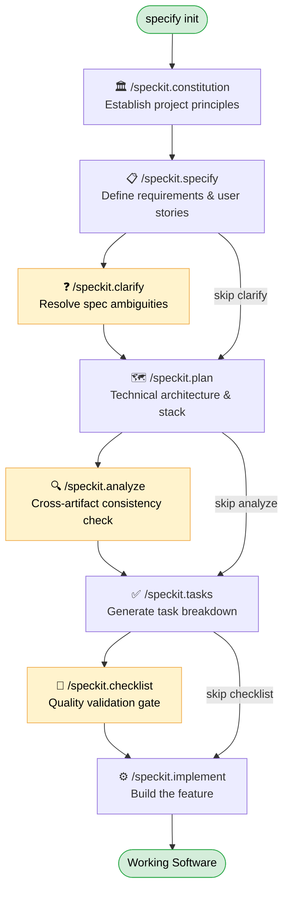

# SpecKit — Complete Workflow Reference

#sdd #speckit #spec-driven-development #workflow #ai-agents

> **SpecKit** is GitHub's open-source toolkit for **Spec-Driven Development (SDD)** — a structured approach that transforms requirements into working software through a series of checkpointed phases, guided by AI agents. It works with 20+ agents including Claude, Copilot, Gemini, Cursor, and Windsurf.

---

## What Problem It Solves

SpecKit addresses "vibe coding" — the pattern of jumping straight into implementation with an AI agent, producing code that drifts from actual requirements. By putting specifications first, it ensures the AI and developer share a common, documented understanding before a single line of code is written.

---

## Installation

**Persistent installation** (recommended for repeated use):
```bash
uv tool install specify-cli --from git+https://github.com/github/spec-kit.git@vX.Y.Z
```

**One-time usage** (no install needed):
```bash
uvx --from git+https://github.com/github/spec-kit.git@vX.Y.Z specify init
```

**Initialize a project:**
```bash
specify init <project_name> --ai claude    # new directory
specify init . --ai claude                 # current directory
specify init --here --ai claude            # alias for above
```

During `init`, SpecKit generates the slash-command prompt files for your chosen agent and sets up the `.specify/` folder structure in your project.

---

## Core Workflow

The five main phases run in sequence. Each produces artifacts that the next phase consumes.

### Phase Sequence



> 🟡 Yellow nodes are **optional** steps. All other nodes are required.

---

### Phase 1 — Constitution `/speckit.constitution`

**Purpose:** Establish the non-negotiable governing principles of the project before anything else is defined.

**Artifacts produced:**

```
.specify/
└── memory/
    └── constitution.md        ← project principles (created or updated)
```

`constitution.md` codifies:
- Code quality standards
- Testing requirements and coverage expectations
- UX consistency rules
- Performance targets
- Security constraints
- Architectural preferences

**Why it matters:** All subsequent commands reference the constitution to stay aligned. It acts as a source of truth that prevents the AI from drifting into patterns that conflict with your standards.

**When to run:** Once, at project start. Can be revisited if foundational decisions change.

> After this phase, SpecKit also scaffolds the full `.specify/` infrastructure — scripts and templates — alongside `constitution.md`.

---

### Phase 2 — Specify `/speckit.specify`

**Purpose:** Define *what* you are building — features, user flows, and acceptance criteria. Focus on the "what" and "why", not the tech stack.

**Artifacts produced:**

```
.specify/
├── memory/
│   └── constitution.md
├── scripts/
│   ├── check-prerequisites.sh
│   ├── common.sh
│   ├── create-new-feature.sh
│   ├── setup-plan.sh
│   └── update-claude-md.sh
├── specs/
│   └── 001-<feature-name>/
│       └── spec.md             ← feature specification (new file)
└── templates/
    ├── plan-template.md
    ├── spec-template.md
    └── tasks-template.md
```

`spec.md` contains:
- Feature description and scope boundaries
- User stories with acceptance criteria
- Key user flows end-to-end
- Review & Acceptance Checklist (generated by the agent)
- Non-functional requirements

SpecKit also creates a **new git branch** named after the feature (e.g., `001-create-taskify`) to track the feature's spec artifacts.

**Tips:**
- Be as explicit as possible about user-facing behavior
- Do not mention the tech stack yet — that comes in Plan
- List explicit out-of-scope items to prevent scope creep

---

### ⚙️ Optional — Clarify `/speckit.clarify`

**Purpose:** Surface and resolve ambiguities in the specification *before* planning begins. Strongly recommended between Specify and Plan.

**Artifacts produced:**

```
.specify/specs/001-<feature-name>/
└── spec.md    ← updated in-place with a Clarifications section appended
```

The agent runs sequential, coverage-based questioning against the spec. Each answer is recorded in a `Clarifications` section inside `spec.md`, locking in agreed-upon interpretations before technical planning begins.

**When to use:**
- The spec has complex business logic or conditional flows
- Multiple interpretations of a requirement are possible
- You want to reduce rework and agent course-corrections during implementation

> If you intentionally skip clarification (e.g., spike or exploratory prototype), explicitly state this so the agent doesn't block on missing clarifications.

---

### Phase 3 — Plan `/speckit.plan`

**Purpose:** Translate the specification into a concrete technical implementation strategy. This is where you introduce the tech stack.

**Artifacts produced:**

```
.specify/
├── CLAUDE.md                              ← project context file (new, at repo root)
├── memory/
│   └── constitution.md
├── scripts/ (unchanged)
├── specs/
│   └── 001-<feature-name>/
│       ├── spec.md
│       ├── plan.md                        ← implementation plan (new)
│       ├── data-model.md                  ← data model and schema (new)
│       ├── research.md                    ← tech stack research notes (new)
│       ├── quickstart.md                  ← local setup instructions (new)
│       └── contracts/
│           ├── api-spec.json              ← REST API contract (new)
│           └── signalr-spec.md            ← real-time/event contract (new, if applicable)
└── templates/
    ├── CLAUDE-template.md                 ← added by this phase
    ├── plan-template.md
    ├── spec-template.md
    └── tasks-template.md
```

`plan.md` contains:
- Chosen tech stack and rationale
- Architecture decisions (component structure, data models, APIs)
- How each requirement from the spec will be addressed technically
- Dependencies and integration points

Additional artifacts (`data-model.md`, `research.md`, `quickstart.md`, `contracts/`) are generated when the project scope warrants them.

> After Plan, it is worth asking the agent to audit the plan for over-engineered components and to verify it adheres to the constitution.

---

### ⚙️ Optional — Analyze `/speckit.analyze`

**Purpose:** Cross-artifact consistency and coverage check. Run after `/speckit.tasks`, before `/speckit.implement`.

**Artifacts produced:**

The agent produces an in-conversation analysis report (and may annotate existing spec/plan/tasks files). It identifies:
- Requirements in `spec.md` not covered by `plan.md` or `tasks.md`
- Contradictions between `constitution.md`, `spec.md`, and `plan.md`
- Missing edge cases or gaps in test coverage
- Over-engineered or under-specified components

**When to use:**
- Large or complex projects with many interdependencies
- When you want confidence that nothing was dropped between phases
- Before committing to implementation on a hard deadline

---

### Phase 4 — Tasks `/speckit.tasks`

**Purpose:** Break the implementation plan into granular, actionable task units ready for execution.

**Artifacts produced:**

```
.specify/specs/001-<feature-name>/
└── tasks.md    ← task breakdown (new file)
```

`tasks.md` is structured by user story and contains:
- Task breakdown organized by user story — each story becomes a separate implementation phase
- Dependency management — tasks are ordered to respect dependencies (models before services, services before endpoints, etc.)
- Parallel execution markers `[P]` for tasks that can run concurrently
- File path specifications — each task includes exact file paths where implementation should occur
- Test-driven development structure — test tasks are included and ordered before their corresponding implementation tasks
- Checkpoint validations — each user story phase ends with a checkpoint to validate independent functionality before moving on

**Tips:** Review the task list carefully before running Implement. Reorder, merge, or split tasks to match your preferred development flow.

---

### ⚙️ Optional — Checklist `/speckit.checklist`

**Purpose:** Generate a custom quality-validation checklist as a completion gate before implementation begins.

**Artifacts produced:**

The agent generates a checklist (inline in conversation or appended to `spec.md`) that verifies:
- All requirements from `spec.md` are represented in `tasks.md`
- `plan.md` is internally consistent
- Test coverage is specified
- Definition-of-done criteria are explicit for each user story

The checklist functions like "unit tests for English" — a structured pass over every artifact to catch omissions before the agent writes code.

**When to use:**
- Team projects where multiple reviewers need a completeness audit
- Regulated or high-stakes domains where completeness must be documented
- As a final gate before handing work to a developer or autonomous agent run

---

### Phase 5 — Implement `/speckit.implement`

**Purpose:** Execute all tasks from `tasks.md` to build the features according to the plan.

**Artifacts produced:**

Working source code across the project — files, components, tests, migrations, config, and anything else specified in `tasks.md`. Before generating code the agent:

1. Validates all prerequisites are in place (`constitution.md`, `spec.md`, `plan.md`, `tasks.md`)
2. Parses the task breakdown from `tasks.md`
3. Executes tasks in order, respecting dependencies and `[P]` parallel markers
4. Follows the TDD approach defined in the task plan
5. Provides progress updates and handles errors

**Best practices:**
- Ensure required CLI tools are installed locally (e.g., `dotnet`, `npm`, `python`) — the agent will invoke them
- After implementation, test the application and copy any runtime or browser console errors back to the agent for resolution
- Use `[P]` markers to run independent work streams in parallel when your agent supports it

---

## Full Workflow Summary

| Step | Command | Required | Artifacts produced |
|---|---|---|---|
| 1 | `/speckit.constitution` | ✅ Core | `.specify/memory/constitution.md` |
| 2 | `/speckit.specify` | ✅ Core | `.specify/specs/NNN-<name>/spec.md` + new git branch |
| 3 | `/speckit.clarify` | ⚙️ Optional | `spec.md` updated with Clarifications section |
| 4 | `/speckit.plan` | ✅ Core | `plan.md`, `data-model.md`, `research.md`, `quickstart.md`, `contracts/api-spec.json`, `contracts/*-spec.md`, `CLAUDE.md` |
| 5 | `/speckit.analyze` | ⚙️ Optional | In-conversation coverage & consistency report |
| 6 | `/speckit.tasks` | ✅ Core | `.specify/specs/NNN-<name>/tasks.md` |
| 7 | `/speckit.checklist` | ⚙️ Optional | In-conversation (or appended) quality checklist |
| 8 | `/speckit.implement` | ✅ Core | Working source code across the project |

---

## Project File Structure (after full workflow)

```
<project-root>/
├── CLAUDE.md                              ← added by /speckit.plan
└── .specify/
    ├── memory/
    │   └── constitution.md                ← /speckit.constitution
    ├── scripts/
    │   ├── check-prerequisites.sh
    │   ├── common.sh
    │   ├── create-new-feature.sh
    │   ├── setup-plan.sh
    │   └── update-claude-md.sh
    ├── specs/
    │   └── 001-<feature-name>/            ← branch-scoped feature directory
    │       ├── spec.md                    ← /speckit.specify (+ clarify appends here)
    │       ├── plan.md                    ← /speckit.plan
    │       ├── data-model.md              ← /speckit.plan
    │       ├── research.md                ← /speckit.plan
    │       ├── quickstart.md              ← /speckit.plan
    │       ├── tasks.md                   ← /speckit.tasks
    │       └── contracts/
    │           ├── api-spec.json          ← /speckit.plan
    │           └── *-spec.md              ← /speckit.plan (protocol-specific)
    └── templates/
        ├── CLAUDE-template.md
        ├── plan-template.md
        ├── spec-template.md
        └── tasks-template.md
```

---

## Key Concepts

**Spec-Driven Development (SDD):** A methodology that treats the specification as a first-class artifact. Implementation only begins once spec, plan, and tasks are all reviewed and approved.

**Checkpointing:** Each phase produces artifacts you review before advancing. This is the mechanism that prevents AI drift and keeps the human in control.

**Branch-scoped specs:** Each feature gets its own git branch and a matching `specs/NNN-<name>/` directory. Specs live alongside the code they describe.

**SPECIFY_FEATURE env var:** For non-Git environments, set `SPECIFY_FEATURE=<feature-directory-name>` to tell the agent which feature to work on (e.g., `001-photo-albums`). Must be set in the agent's context before running `/speckit.plan` or later commands.

**Brownfield vs. Greenfield:** SpecKit works with both existing and new codebases. On brownfield projects, `constitution.md` can be derived from existing conventions rather than defined from scratch.

**Extensions vs. Presets:** Extensions add new commands and workflows; Presets customize the templates and output format of existing commands. Both are managed via `specify extension add` / `specify preset add`.

---

## Related Notes

- [[SDD-Index]]
- [[BMAD-Getting-Started]]
- [[BMAD-Workflows-Reference]]

---

## Sources

- [GitHub — spec-kit repository](https://github.com/github/spec-kit)
- [Diving Into Spec-Driven Development With GitHub Spec Kit — Microsoft for Developers](https://developer.microsoft.com/blog/spec-driven-development-spec-kit)
- [Putting Spec Kit Through Its Paces — Scott Logic](https://blog.scottlogic.com/2025/11/26/putting-spec-kit-through-its-paces-radical-idea-or-reinvented-waterfall.html)
- [Spec-Driven Development: 0 to 1 with Spec-kit & Cursor — Mad Devs](https://maddevs.io/writeups/project-creation-using-spec-kit-and-cursor/)
