# Vertical Slice Architecture

#architecture #design-patterns #software-engineering #application-architecture #cqrs #feature-driven

---

## What Is It?

Vertical Slice Architecture is an approach to organizing application code **around features or use cases** rather than around technical layers. Instead of grouping all controllers together, all services together, and all data access code together (horizontal layers), you group everything that belongs to a single feature in one place — from the entry point (API, event, UI action) all the way down to the data store.

The guiding principle, coined by Jimmy Bogard, is:

> *"Minimize coupling between slices, and maximize coupling within a slice."*

A "slice" represents a single, discrete request or user action — for example: "place an order", "register a user", "get product details". Each slice owns everything it needs to fulfil that request.

---

## The Problem with Layered Architecture

Traditional N-Tier (horizontal) architecture organizes code by technical concern. A single feature must be implemented across every layer simultaneously, creating scattered, low-cohesion codebases.



This introduces real-world friction:

- **Low cohesion**: related code for one feature is scattered across many layers and files
- **Cross-layer coupling**: a change to one feature requires touching multiple layers
- **Forced abstractions**: shared repositories, services, and interfaces that don't always reflect real requirements
- **High blast radius**: changes to shared components can break unrelated features
- **Difficult to onboard**: developers must understand the entire layer stack before contributing to a single feature

---

## Core Concept: The Slice

A vertical slice is a self-contained unit that captures the **full implementation of a single use case**. All code for one feature travels together from request to response, with no detours through shared layer abstractions.


Each slice is independent. Adding, changing, or deleting a feature touches exactly one slice.

### Anatomy of a Single Slice


### Feature Folder Structure

All files for a use case live in a single folder. The folder is the unit of work.

```
/features
  /place-order
    ├── PlaceOrderRequest
    ├── PlaceOrderHandler
    ├── PlaceOrderValidator
    ├── PlaceOrderResponse
    └── PlaceOrderTests
  /get-order-summary
    ├── GetOrderSummaryRequest
    ├── GetOrderSummaryHandler
    ├── GetOrderSummaryResponse
    └── GetOrderSummaryTests
  /register-user
    ├── RegisterUserRequest
    ├── RegisterUserHandler
    ├── RegisterUserResponse
    └── RegisterUserTests
```

Adding a feature = adding a folder. Deleting a feature = deleting a folder. Nothing else changes.

---

## Key Patterns

### CQRS — Command Query Responsibility Segregation

Vertical Slice Architecture pairs naturally with CQRS because it forces you to think in terms of **intent**. Commands and queries are natural slice boundaries.



The separation allows you to:
- Optimise reads and writes independently
- Use different data models for each side
- Apply different validation rules per operation

### REPR Pattern — Request / Endpoint / Response

A lean pattern for API-facing slices that maps cleanly to HTTP semantics:

| Element | Role |
|---|---|
| **Request** | Encapsulates the input data |
| **Endpoint / Handler** | Executes the logic |
| **Response** | Shapes the output |

Each slice is entirely self-describing — reading one file tells you everything about one use case.

### Mediator Pattern

A mediator (dispatcher) decouples the caller from the handler. The caller sends a request object; the mediator routes it to the right handler. This enables a **uniform pipeline** for cross-cutting concerns without touching individual handlers.


Cross-cutting concerns (logging, authorisation, caching, tracing) are injected into the pipeline once and apply to all slices automatically.

---

## Best Practices

**1. One slice per use case**
Each discrete user action or system event should be its own slice. Avoid merging multiple operations into one handler.

**2. No cross-slice dependencies**
Slices must not call each other directly. If two features share logic, extract it into a shared kernel or domain model — but be deliberate and conservative about what goes there.

**3. Co-locate tests with the slice**
Tests belong in the same folder as the feature they cover. This makes it immediately clear what is tested, and removing a feature means removing its tests automatically.

**4. Prefer duplication over wrong abstraction**
When two slices need similar logic, it is often better to duplicate it than to create a premature shared abstraction. Abstract only when a pattern has proven stable across multiple slices.

**5. Tailor implementation to the slice's needs**
A read-heavy query slice might use raw SQL for performance. A complex write slice might use a rich domain model. A simple CRUD slice might skip most ceremony entirely. There is no requirement to use the same approach everywhere.

**6. Keep shared infrastructure minimal and stable**
Shared infrastructure (database connections, messaging clients, utility helpers) is fine. What you want to avoid is shared business logic that creates hidden coupling. Shared code should be infrastructure, not feature logic.

**7. Avoid "god slices"**
A slice that grows to handle too many concerns becomes a liability. If a handler is doing too much, it is a signal to refactor — extracting domain logic into value objects, aggregates, or domain services within that slice.

**8. Establish a consistent naming convention**
Use action-based names that reflect the use case clearly: `RegisterUser`, `PlaceOrder`, `ApproveInvoice`. Avoid generic names like `UserService` or `OrderManager`.

---

## What Belongs in a Slice vs. What Is Shared



| Belongs in the Slice | Can Be Shared |
|---|---|
| Validation rules for this request | Database connection / ORM context |
| Business logic for this use case | Messaging / event bus client |
| Response shaping / mapping | Authentication / authorization middleware |
| Slice-specific data access | Domain entities / aggregates |
| Slice tests | Error handling infrastructure |

The domain model (entities, value objects, aggregates) can be shared, but keep it free of application-specific workflow logic. Application logic always stays inside the slice.

---

## Benefits

- **Predictable change impact** — modifying a feature touches only one place; there are no ripple effects across layers
- **Faster development** — developers work on a smaller, focused surface per feature
- **Parallel teamwork** — multiple teams or individuals can build different slices simultaneously with minimal conflicts
- **Easier code reviews** — a PR for a feature contains all the context needed to review it
- **Cleaner deletions** — removing a feature means removing its folder; nothing else breaks
- **Simplified onboarding** — a new developer can understand one slice without needing to understand the entire system
- **Flexible implementation** — each slice can use the technology and pattern that best fits its requirements

---

## Trade-offs and Challenges

- **Code duplication** — similar patterns may repeat across slices; this is intentional but requires discipline to manage
- **Requires team maturity** — without shared design principles, slices can become inconsistent and messy over time
- **Shared domain model discipline** — it is tempting to bloat the shared domain model; must be kept lean
- **Framework guidance may conflict** — some frameworks encourage layer-based organisation; adapting them to vertical slices requires intentional effort
- **Not a silver bullet for complex domains** — for very rich domain logic, vertical slices work best in combination with Domain-Driven Design (DDD) tactical patterns (aggregates, domain events, etc.)

---

## Vertical Slices vs. Layered Architecture

| Concern | Layered Architecture | Vertical Slice Architecture |
|---|---|---|
| Code organisation | By technical role (controller, service, repo) | By feature / use case |
| Cohesion | Low — related code is spread across layers | High — all code for a feature is together |
| Coupling | High across layers for a single feature | Low between slices |
| Change impact | Requires changes across multiple layers | Confined to one slice |
| Onboarding | Need to understand the full layer structure | Can start with a single slice |
| Flexibility | Uniform approach enforced across all features | Each slice can use different approaches |
| Testing | Test per layer | Test per behaviour / use case |

---

## Relationship to Other Architectural Styles



- **Clean Architecture / Onion Architecture** — complementary; apply vertical slicing within the application layer to organise use cases
- **Hexagonal Architecture** — ports and adapters handle external boundaries; vertical slicing organises the internal use cases
- **Domain-Driven Design (DDD)** — pairs well; slices map naturally to commands and queries within a bounded context; domain logic lives in the shared domain model
- **Microservices** — vertical slices within a service provide the same isolation benefits at the code level that microservices provide at the deployment level
- **Event-Driven Architecture** — event handlers are natural slices; each consumer of an event is its own self-contained unit

---

## When to Use Vertical Slice Architecture

**Good fit when:**
- The application has many distinct features or use cases
- Multiple teams are working on the same codebase
- You want to move fast on individual features without fear of side effects
- Features have varying complexity and different implementation needs

**Consider alternatives when:**
- The domain is extremely small and a simple layered approach is sufficient
- There is a very high degree of shared logic that would result in excessive duplication
- The team is not yet familiar with patterns like CQRS or mediator, and additional structure would be a net cost

---

## Summary

Vertical Slice Architecture is a practical, feature-centric approach that addresses the inherent friction of horizontal layering. By aligning code organisation with the way users think about functionality, it produces codebases that are easier to navigate, change, test, and grow. The core insight is simple: **the most natural unit of software is not a layer — it is a feature**.

---

## Related Notes

- [[application-architecture]]
- [[cqrs]]
- [[domain-driven-design]]
- [[clean-architecture]]
- [[feature-flags]]

---

*Sources: jimmybogard.com/vertical-slice-architecture, milanjovanovic.tech/blog/vertical-slice-architecture, ssw.com.au/rules/rules-to-better-vertical-slice-architecture*
